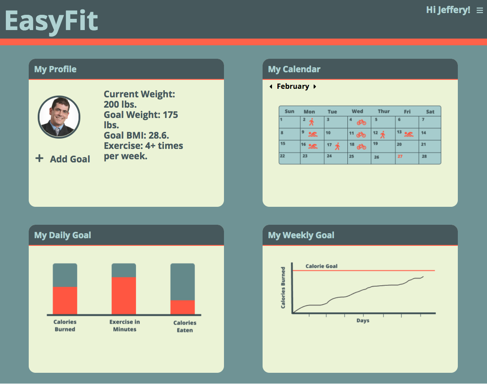
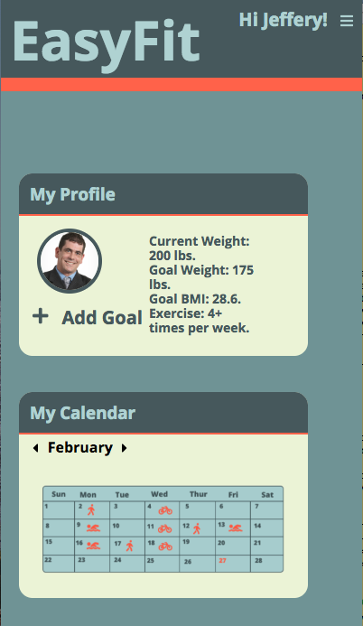

# UX-UI-challenge
## Colors:
  #B8D8D8
  #7A9E9F
  #4F6367
  #F4F8E8
  #FF6D54

## Font
  -Open Sans Extra Bold
  https://fonts.google.com/specimen/Open+Sans?selection.family=Open+Sans:400,800
  
## wireframe

## Desktop comp

## Mobile View

## Our Screenshots

